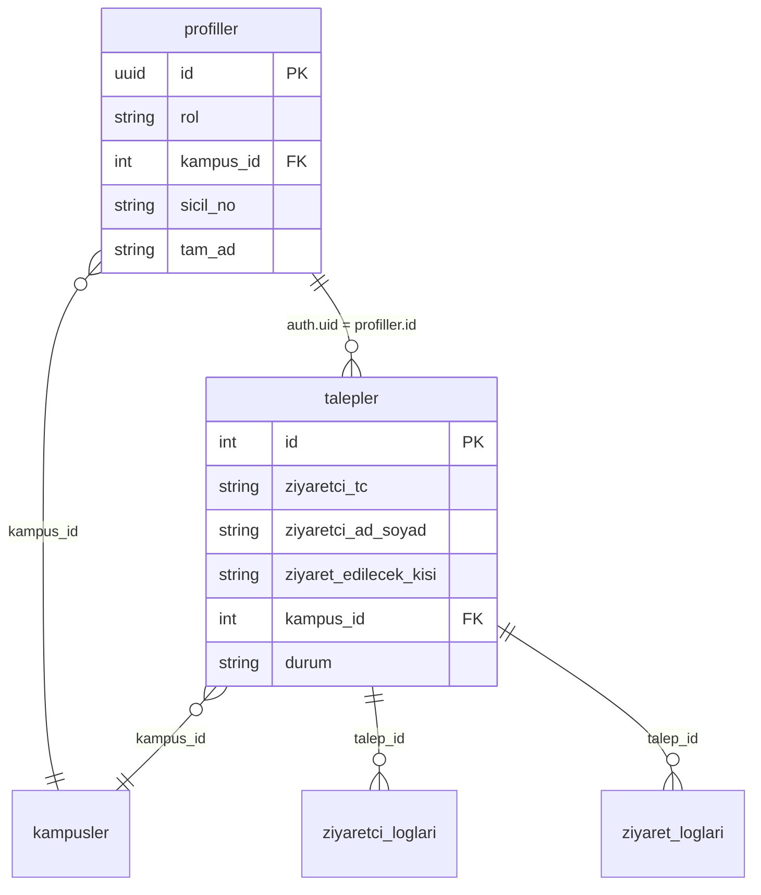

# OWASP Top 10 — THY Sunumu Savunma Rehberi ve Devir Teslim

**Proje:** Ziyaretçi Yönetim Sistemi (VMS)  
**Hedef kitle:** THY Altyapı, Veritabanı ve Bilgi Güvenliği ekipleri  
**Sürüm:** Faz 1 MVP → Faz 2 THY On-Premise geçişi  
**Referans:** [OWASP Top 10:2021](https://owasp.org/Top10/)

---

## 1. Dokümanın amacı

Bu rehber, VMS kod tabanının THY sunucularına taşınması sırasında:

- Her OWASP Top 10 (2021) maddesi için **mevcut savunma durumunu** (Faz 1),
- **THY sunucularında tamamlanması gereken** kontrolleri (Faz 2),
- **RLS mimarisinin** veritabanı ekibine devrini,
- **KVKK kapsamındaki şifreleme** beklentilerini,
- **Sorumluluk Matrisi** ile hangi önlemin hangi ekibe ait olduğunu

tek bir kurumsal devir-teslim dosyasında toplar.

> **Önemli:** Uygulama katmanında `app/api/` altında **sıfır REST API Route** vardır. Tüm yetkili işlemler `app/actions/` Server Actions ile yürütülür; Faz 2’de de gereksiz public API açılmamalıdır.

---

## 2. OWASP Top 10 (2021) — Savunma durumu ve THY geçişi

Aşağıdaki tabloda her madde için **sunum savunması** (teknik gerekçe), **Faz 1 (MVP)** durumu ve **Faz 2 (THY On-Premise)** beklentisi özetlenmiştir.

| # | OWASP 2021 | Faz 1 — Uygulama (Mevcut) | Faz 2 — THY sunucuları / kurumsal katman | Sunum savunması (özet) |
|---|------------|---------------------------|------------------------------------------|-------------------------|
| **A01** | Broken Access Control | Middleware rol kontrolü (`personel`, `guvenlik`, `admin`); Server Actions’da `getUser()` + rol/kampüs kontrolü; `ziyaret_edilecek_kisi` sunucuda profilden yazılır | **RLS politikalarının** kurumsal PostgreSQL’de birebir taşınması ve penetration test; LDAP grup ↔ rol eşlemesi | Erişim üç katmanlı: rota (middleware) + iş kuralı (Server Action) + veritabanı (RLS). Anon key tek başına yetki vermez. |
| **A02** | Cryptographic Failures | TC/GSM **görüntülemede** maskeleme (`lib/formatlayici.ts`); HTTPS üzerinden servis; HSTS başlığı (`next.config.ts`) | **HSM/KMS** ile saklama şifrelemesi (TC, GSM, plaka); TLS sonlandırma kurumsal sertifikalar; anahtar rotasyonu | Kişisel veri uygulamada düz metin saklanır; üretim güvenliği **at-rest şifreleme** ile THY KMS sorumluluğundadır. |
| **A03** | Injection | Parametreli Supabase/PostgREST sorguları; React JSX escape; `dangerouslySetInnerHTML` yok; HTML entity (`&gt;` vb.) statik metinlerde | WAF / API gateway giriş filtreleri; DB kullanıcı yetkilerinin minimum privilege ile sınırlandırılması | SQL enjeksiyonu riski düşük; savunma derinliği DB rol ayrımı ile THY tarafında güçlendirilir. |
| **A04** | Insecure Design | Kapalı devre Server Actions; sunucu zaman kontrolü; toplu çıkışta 50 kayıt üst sınırı; KVKK onay akışı (UI) | **Rate limiting**, brute-force kilidi, CAPTCHA/MFA, işlem kotası (reverse proxy / API gateway) | Tasarım bilinçli olarak public REST açmaz; operasyonel kötüye kullanım önlemleri **altyapı** katmanına devredilir. |
| **A05** | Security Misconfiguration | CSP, `X-Frame-Options`, `X-Content-Type-Options`, HSTS, `Referrer-Policy`, `Permissions-Policy` (`next.config.ts`) | Sunucu sertleştirme, güvenlik yamaları, secret store, `.env` yönetimi, SIEM uyarıları | HTTP güvenlik başlıkları uygulamada tanımlı; OS ve reverse proxy sertleştirmesi THY sorumluluğundadır. |
| **A06** | Vulnerable Components | `@supabase/ssr` + güncel Next.js/React; deprecated `auth-helpers` kaldırıldı | Kurumsal **SBOM**, `npm audit` / onaylı paket mirror, CI güvenlik taraması | Bağımlılık yaşam döngüsü Faz 2’de kurumsal pipeline ile yönetilmelidir. |
| **A07** | Auth Failures | Supabase Auth (e-posta/şifre); korumalı rotalarda `getUser()`; sicil tabanlı giriş UX | **Active Directory (LDAP)** entegrasyonu; oturum süresi, idle timeout, hesap kilitleme, MFA | Kimlik Faz 2’de kurumsal AD’ye taşınır; uygulama yalnızca oturum doğrulayıcı olur. |
| **A08** | Data Integrity Failures | Server Actions + audit (`ziyaretci_loglari`, `ziyaret_loglari`); Realtime abonelikleri RLS’e bağlı | İmzalı dağıtım, CI/CD bütünlük kontrolü, Realtime kanal yetkilendirmesi | Kritik mutasyonlar sunucuda; bütünlük kanıtı THY CI/CD ve DB politikalarıyla desteklenir. |
| **A09** | Logging & Monitoring | Uygulama audit insert’leri; hata durumunda `console.error` | **SIEM** entegrasyonu, başarısız giriş / yetkisiz erişim alarmları, log saklama süresi (KVKK) | Denetim izi kısmen uygulamada; merkezi izleme ve saklama **THY SOC** sorumluluğundadır. |
| **A10** | SSRF | Kod tabanında kullanıcı kontrollü `fetch`/URL ile dış istek **yok** | Egress firewall, outbound proxy politikası | SSRF yüzeyi minimal; ağ çıkış politikası altyapıda tanımlanır. |

### 2.1 Madde bazlı detay (sunum ve devir notları)

#### A01 — Broken Access Control

| Konu | Detay |
|------|--------|
| **Faz 1** | `middleware.ts` → `ROUTE_ROLES`; `guvenlik.ts` kampüs filtresi; `ziyaretci.ts` profilden `ziyaret_edilecek_kisi`; `admin.ts` rol doğrulaması |
| **Bilinen gap (Faz 1)** | Ana sayfa (`/`) middleware dışı; bazı idari/güvenlik sorguları istemci Supabase client ile (RLS’e güveniyor); `yeniDurum` beyaz liste sunucuda sıkılaştırılabilir |
| **Faz 2 — THY** | Tüm `talepler`, `profiller`, `kampusler` için RLS export/import; LDAP grup → `profiller.rol` senkronizasyonu; yıllık erişim testi |

#### A02 — Cryptographic Failures

| Konu | Detay |
|------|--------|
| **Faz 1** | Aktarımda TLS; HSTS; maskeleme yalnızca UI |
| **Faz 2 — THY** | Sütun düzeyi veya uygulama öncesi şifreleme (HSM/KMS); yedekleme şifrelemesi; anahtar erişim denetimi |

#### A03 — Injection

| Konu | Detay |
|------|--------|
| **Faz 1** | ORM/PostgREST; Anti-XSS (JSX + entity) |
| **Faz 2 — THY** | DB rol ayrımı (`anon` vs `authenticated` vs `service` yok istemcide); isteğe bağlı WAF kuralları |

#### A04 — Insecure Design

| Konu | Detay |
|------|--------|
| **Faz 1** | Sıfır public API Route; Server Actions |
| **Faz 2 — THY** | **Rate limiting** (login, Server Action POST, Supabase Realtime); CAPTCHA; MFA zorunluluğu politikası |

#### A05 — Security Misconfiguration

| Konu | Detay |
|------|--------|
| **Faz 1** | `next.config.ts` güvenlik başlıkları tamamlandı |
| **Faz 2 — THY** | Reverse proxy başlık geçişi, TLS 1.2+, secret rotation, üretim ortamı izolasyonu |

#### A06 — Vulnerable Components

| Konu | Detay |
|------|--------|
| **Faz 1** | Minimal bağımlılık seti |
| **Faz 2 — THY** | Onaylı artifact registry, otomatik CVE taraması, acil yama prosedürü |

#### A07 — Identification and Authentication Failures

| Konu | Detay |
|------|--------|
| **Faz 1** | Supabase Auth + cookie (`@supabase/ssr`) |
| **Faz 2 — THY** | **Active Directory (LDAP)**; kurumsal parola politikası; oturum timeout; opsiyonel MFA |

#### A08 — Software and Data Integrity Failures

| Konu | Detay |
|------|--------|
| **Faz 1** | Audit tabloları; Server Action bütünlüğü |
| **Faz 2 — THY** | İmzalı build/deploy; Realtime `postgres_changes` kanal yetkisi RLS ile doğrulanmalı |

#### A09 — Security Logging and Monitoring Failures

| Konu | Detay |
|------|--------|
| **Faz 1** | `ziyaretci_loglari`, `ziyaret_loglari` insert |
| **Faz 2 — THY** | SIEM (Splunk/QRadar vb.); başarısız auth ve yetkisiz RLS reddi alarmları |

#### A10 — Server-Side Request Forgery (SSRF)

| Konu | Detay |
|------|--------|
| **Faz 1** | Dış URL `fetch` yok |
| **Faz 2 — THY** | Sunucu egress kısıtı (defense in depth) |

---

## 3. RLS mimarisi — Devir teslim

RLS politikaları **bu Git deposunda tanımlı değildir**; Supabase konsolunda veya ayrı SQL paketinde yönetilmektedir. Üretim güvenliği büyük ölçüde bu politikaların doğruluğuna bağlıdır. THY Veritabanı ekibinin Faz 2’de aşağıdaki modeli kurumsal PostgreSQL’e taşıması beklenir.

### 3.1 Mantıksal veri modeli (özet)



### 3.2 Rol ve erişim matrisi (RLS tasarım hedefi)

| Rol (`profiller.rol`) | `talepler` SELECT | `talepler` INSERT | `talepler` UPDATE | `kampusler` | `profiller` (diğer kullanıcılar) |
|----------------------|-------------------|-------------------|-------------------|-------------|----------------------------------|
| **personel** | Yalnızca `ziyaret_edilecek_kisi` = kendi sicil/e-posta ön eki | Kendi adına insert (durum sunucu/RLS ile sınırlı) | Kısıtlı veya yok | Okuma | Yalnızca kendi satırı |
| **guvenlik** | Kendi `kampus_id` kapsamındaki talepler | Politikaya göre | Durum güncelleme (giriş/çıkış/red) | Okuma | Yalnızca kendi satırı |
| **admin** | Tüm kampüsler / kurum politikası | Politikaya göre | Tam veya politika bazlı | CRUD (idari işlemler) | Kampüs atama vb. |

### 3.3 Uygulama ↔ RLS hizalama kontrol listesi

THY DBA ekibi Faz 2 öncesi aşağıdakileri doğrulamalıdır:

- [ ] `auth.uid()` ile `profiller.id` eşleşmesi zorunlu
- [ ] Anon anahtar ile `talepler` üzerinde yetkisiz UPDATE/DELETE **reddedilmeli**
- [ ] Güvenlik rolü: `kampus_id` dışı kayıtlara erişim **reddedilmeli**
- [ ] Personel: başka sicilin taleplerine SELECT **reddedilmeli**
- [ ] `ziyaretci_loglari` / `ziyaret_loglari`: yalnızca yetkili roller INSERT
- [ ] Realtime `postgres_changes` abonelikleri aynı RLS kurallarına tabi
- [ ] RLS politikaları versiyon kontrolünde (SQL migration paketi) saklanmalı

### 3.4 Faz geçişi

| Aşama | Sorumlu | Çıktı |
|-------|---------|--------|
| Faz 1 export | Uygulama / mevcut Supabase yöneticisi | RLS `CREATE POLICY` SQL dump |
| Faz 2 import | **THY Veritabanı** | Kurumsal PostgreSQL + test senaryoları |
| Doğrulama | **THY Bilgi Güvenliği** | Erişim test raporu (A01 kapanışı) |

---

## 4. KVKK — Şifreleme ve kişisel veri devir teslimi

6698 sayılı KVKK kapsamında işlenen veri kategorileri (uygulama ve form metinleriyle uyumlu):

| Veri kategorisi | Örnek alanlar | Faz 1 işleme | Faz 2 — THY beklentisi |
|-----------------|---------------|--------------|-------------------------|
| Kimlik | Ad-soyad, TC (`ziyaretci_tc`) | DB’de düz metin; UI’da maskeleme | **HSM/KMS** ile at-rest şifreleme veya tokenizasyon |
| İletişim | GSM (`ziyaretci_gsm`) | Aynı | Aynı |
| İşlem güvenliği | Giriş-çıkış saatleri, plaka, durum | Audit logları | Log şifreleme + SIEM saklama süresi |
| İşlem kaydı | `ziyaret_edilecek_kisi`, `kampus_id` | Profil eşlemesi | Erişim logları |

### 4.1 Şifreleme katmanları

```text
[Kullanıcı] --TLS--> [THY Reverse Proxy] --TLS--> [Next.js / APEX]
                                              |
                                              v
                                    [PostgreSQL + RLS]
                                    At-rest: HSM/KMS (Faz 2)
```

| Katman | Faz 1 | Faz 2 sorumlusu |
|--------|-------|-----------------|
| Aktarımda (in-transit) | HTTPS, HSTS (uygulama başlığı) | THY: TLS sonlandırma, sertifika yönetimi |
| Saklamada (at-rest) | Supabase varsayılan disk şifrelemesi | **THY:** HSM/KMS sütun veya TDE |
| Anahtar yönetimi | Supabase proje anahtarları | **THY:** Kurumsal KMS, rotasyon, erişim logu |
| Görüntüleme | `maskeleTC`, `maskeleTelefon` | Uygulama ekibi (korunur) |
| Silme / anonimleştirme | Politika tanımlı değil (MVP) | **THY + Hukuk:** saklama ve imha prosedürü |

### 4.2 KVKK devir teslim çıktıları (THY’den beklenen)

1. Kişisel veri envanteri (VMS için alt kayıt).
2. HSM/KMS entegrasyon mimarisi diyagramı.
3. Yedekleme şifreleme ve anahtar kurtarma prosedürü.
4. Veri işleme amacı ve saklama süresi onayı (güvenlik ziyaret kayıtları).
5. Üçüncü taraf aktarım listesi (Faz 1 Supabase → Faz 2 kapatılacak mı?) onayı.

---

## 5. Sorumluluk Matrisi (RACI özeti)

**A** = Accountable (nihai sorumlu) · **R** = Responsible (uygulayan) · **C** = Consulted · **I** = Informed

| Güvenlik önlemi / kontrol | Faz 1 — Uygulama ekibi (MVP) | Faz 2 — THY Altyapı | Faz 2 — THY Veritabanı | Faz 2 — THY Bilgi Güvenliği |
|---------------------------|------------------------------|---------------------|-------------------------|------------------------------|
| Next.js Server Actions (sıfır API Route) | **R/A** | I | I | C |
| Middleware rol kontrolü | **R/A** | C (LDAP eşlemesi) | I | C |
| OWASP HTTP başlıkları (CSP, HSTS, XFO) | **R/A** | **R** (proxy geçişi) | I | C |
| **Rate limiting** / DDoS | — | **R/A** | I | C |
| **Active Directory (LDAP) Auth** | C (entegrasyon noktası) | **R/A** | I | C |
| **RLS politikaları** | C (iş kuralı gereksinimi) | I | **R/A** | **R** (test) |
| **HSM/KMS şifreleme** (TC, GSM, at-rest) | C (alan listesi) | **R** (KMS bağlantısı) | **R/A** (şema/şifreleme) | **A** (onay) |
| TLS / sertifika yönetimi | C | **R/A** | I | C |
| SIEM / merkezi loglama | C (log şeması) | **R/A** | C | **R** (kural seti) |
| WAF / egress firewall | — | **R/A** | I | C |
| KVKK saklama & imha politikası | I | C | C | **R/A** |
| Penetrasyon / erişim testi | C | I | **R** | **R/A** |
| Bağımlılık / CVE yönetimi (SBOM) | **R** (geliştirme) | **R/A** (kurumsal pipeline) | I | C |
| Audit tabloları (`ziyaretci_loglari`, `ziyaret_loglari`) | **R/A** | I (SIEM aktarımı) | **R** (tablo/retention) | C |
| Kişisel veri UI maskeleme | **R/A** | I | I | I |
| MFA / CAPTCHA | — | **R/A** (politika) | — | **A** |

---

## 6. Faz 2 — THY altyapı minimum gereksinim listesi

THY Altyapı ekibinin geçiş öncesi sağlaması beklenen minimum set:

1. **Reverse proxy** üzerinde rate limiting (IP + kullanıcı bazlı).
2. **Active Directory (LDAP)** federasyonu; uygulama oturumunun AD assertion ile doğrulanması.
3. **HSM/KMS** bağlantısı; TC/GSM için at-rest şifreleme anahtarı THY kasasında.
4. TLS 1.2+ ve kurumsal sertifika; HSTS proxy ile uyumlu.
5. SIEM’e uygulama ve veritabanı log aktarımı.
6. Üretim secret’ları: Vault / kurumsal secret store (`.env` dosyası sunucuda düz metin olmamalı).
7. Egress kısıtı (SSRF defense in depth).

THY Veritabanı ekibinin minimum seti:

1. RLS SQL paketinin import ve regresyon testi.
2. Rol bazlı DB kullanıcıları (uygulama servis hesabı ≠ DBA).
3. Yedekleme şifrelemesi ve restore tatbikatı.
4. Realtime publication yetkilerinin RLS ile uyumu.

---

## 7. İlgili dosyalar (kod referansı)

| Dosya | Güvenlik işlevi |
|-------|-----------------|
| `middleware.ts` | Rol tabanlı rota koruması |
| `app/actions/guvenlik.ts` | Güvenlik işlemleri + audit |
| `app/actions/ziyaretci.ts` | Ziyaretçi kaydı + zaman kilidi |
| `app/actions/admin.ts` | İdari profil güncelleme + RLS geri bildirimi |
| `next.config.ts` | CSP ve güvenlik başlıkları |
| `lib/formatlayici.ts` | TC / telefon maskeleme |
| `lib/audit.ts` | Denetim izi yazımı |

---

## 8. Onay ve revizyon

| Alan | Değer |
|------|--------|
| Doküman | `docs/THY-DEVIR-TESLIM.md` |
| İlk yayın | Faz 1 MVP devir teslimi |
| Sonraki revizyon | Faz 2 geçiş tamamlandığında RLS + KMS kanıt dokümanı ile güncellenecek |

---

*Bu belge, OWASP Top 10 (2021) kod incelemesi, mevcut mimari ve THY On-Premise geçiş planına dayanır. RLS SQL dump ve KMS mimarisi Faz 2 kapanış deliverable’larıdır.*
